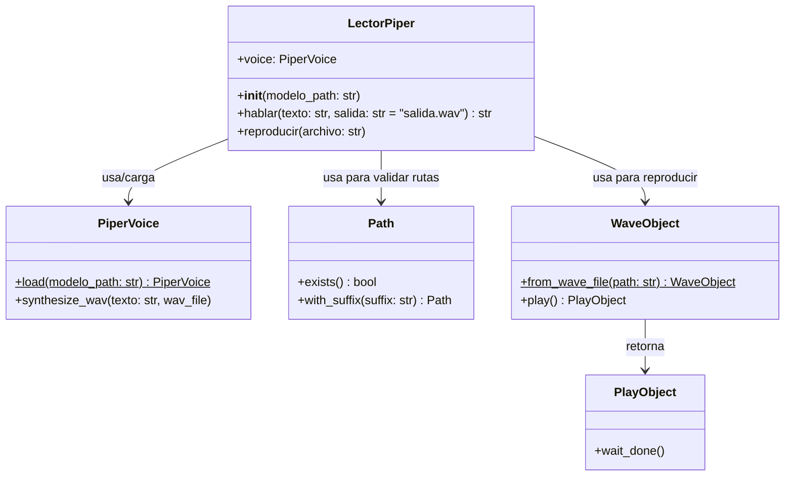
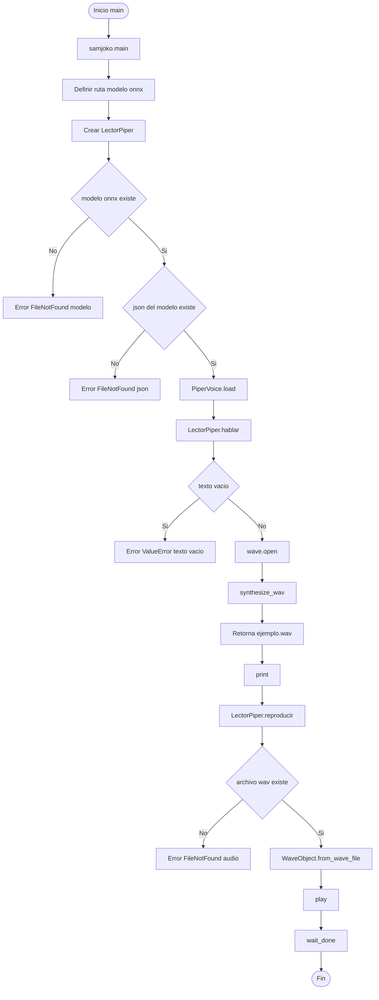
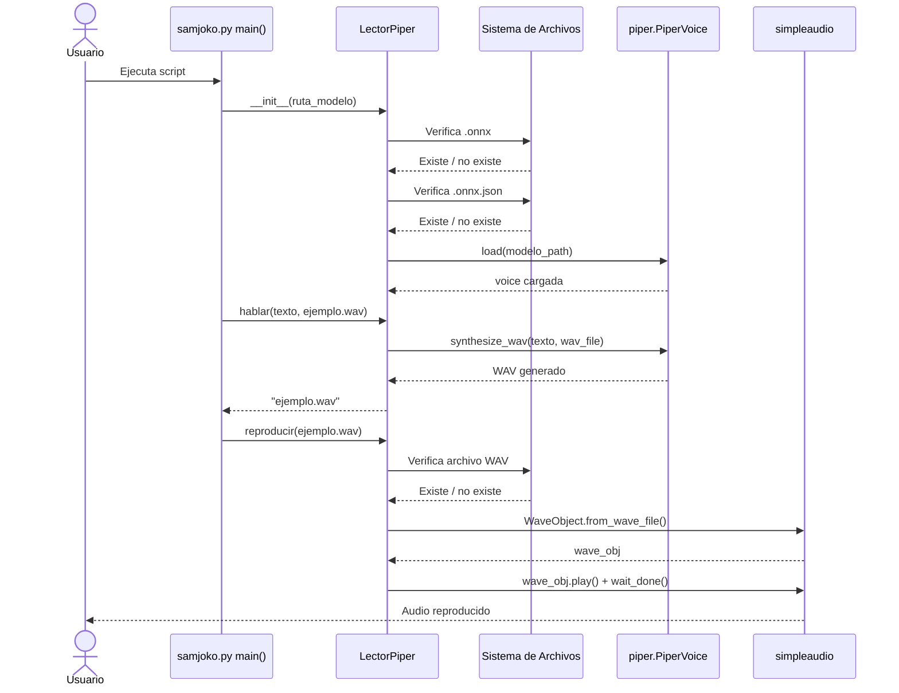
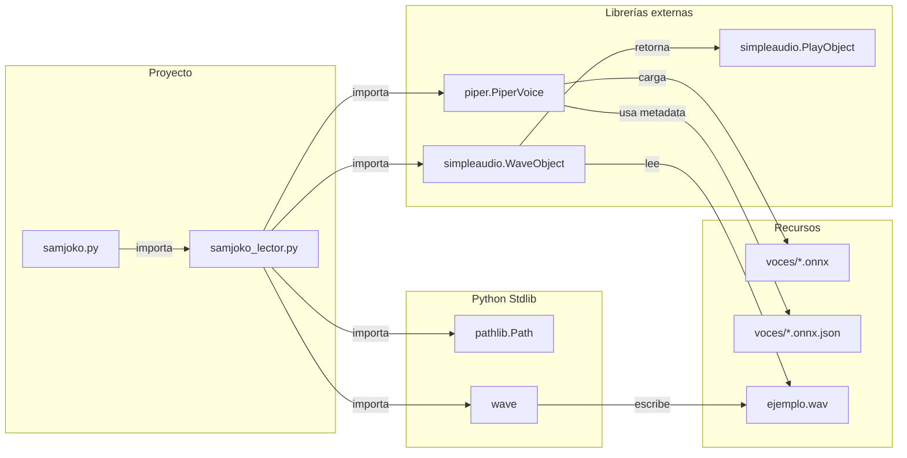
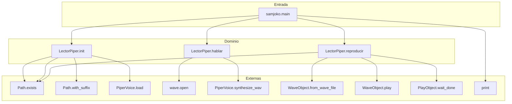

# Documentación — SamJoko Lector Básico

Proyecto de síntesis de voz en español con **Piper TTS** y reproducción local con **simpleaudio**.
El flujo principal crea un lector, sintetiza un WAV a partir de texto y luego lo reproduce.

---

## 1. Diagrama de Clases

---

## 2. Diagrama de Flujo de Ejecución

---

## 3. Diagrama de Secuencia

---

## 4. Mapa de Dependencias entre Módulos

---

## 5. Diagrama de Relaciones entre Funciones

---

## 6. Resumen de responsabilidades

| Módulo / Clase | Responsabilidad |
|---|---|
| `samjoko.py` (`main`) | Punto de entrada: define modelo, orquesta síntesis y reproducción |
| `LectorPiper.__init__` | Valida archivos del modelo (`.onnx` y `.json`) y carga la voz |
| `LectorPiper.hablar` | Genera audio WAV desde texto usando `PiperVoice.synthesize_wav` |
| `LectorPiper.reproducir` | Reproduce WAV con `simpleaudio` y espera fin de reproducción |
| `piper.PiperVoice` | Librería TTS externa para carga de modelo y síntesis |
| `simpleaudio.WaveObject/PlayObject` | Librería externa para reproducción de audio |
| `pathlib.Path` / `wave` | Soporte de rutas y escritura de contenedor WAV |
